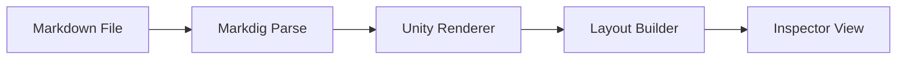
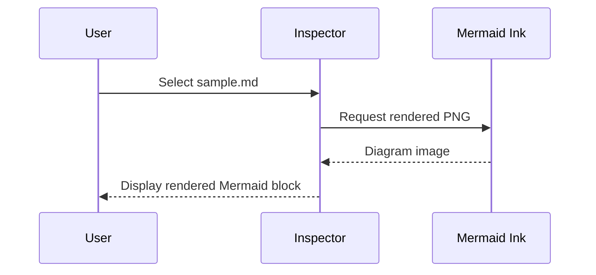
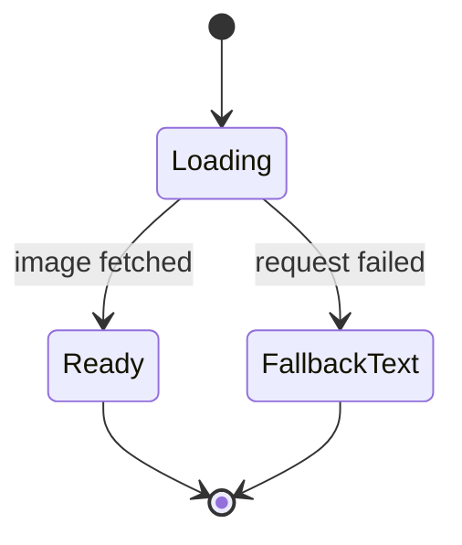
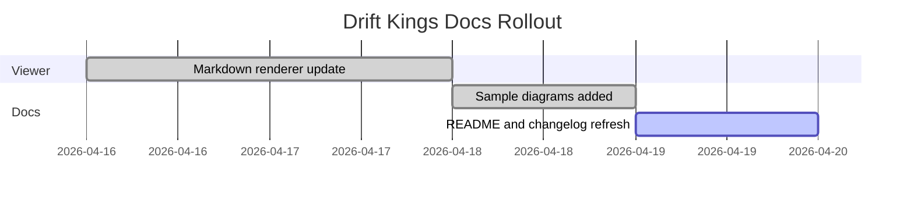

# Unity Markdown Viewer — Full Feature Reference {#top}

This document is both a **regression test** and a **feature showcase** for the Unity Markdown Viewer. Every section exercises a specific rendering feature. If something looks wrong here, that feature has a bug.

---

## Table of Contents

- [Headings](#headings)
- [Inline Styles](#inline-styles)
- [Lists](#lists)
- [Blockquotes & Admonitions](#blockquotes)
- [Tables](#tables)
- [Code & Syntax Highlighting](#code)
- [Mermaid Diagrams](#mermaid)
- [Links & Images](#links)
- [Emoji](#emoji)
- [Task Lists](#task-lists)
- [Definition Lists](#definitions)
- [Miscellaneous](#misc)

---

## 1. Headings {#headings}

# Heading 1 — largest
## Heading 2
### Heading 3
#### Heading 4
##### Heading 5
###### Heading 6 — smallest

All six levels must render with distinct sizes and colours. H1 adds a horizontal rule below it.

---

## 2. Inline Styles {#inline-styles}

| Syntax | Renders as |
| :----- | :--------- |
| `**bold**` | **bold** |
| `*italic*` | *italic* |
| `***bold italic***` | ***bold italic*** |
| `~~strikethrough~~` | ~~strikethrough~~ |
| `==highlight==` | ==highlighted text== |
| `~sub~` | H~2~O |
| `^super^` | E = mc^2^ |
| `++underline++` | ++underlined text++ |
| `` `inline code` `` | `inline code` |

Combined: ***==bold italic highlight==*** — all three flags active simultaneously.

Strikethrough inside a sentence: the answer is ~~42~~ **unknown**.

---

## 3. Lists {#lists}

### Unordered (3 levels)

- Top level item
  - Second level item
    - Third level item — deeply nested
    - Another third level
  - Back to second
- Another top item

### Ordered

1. First step
2. Second step
   1. Sub-step A
   2. Sub-step B
3. Third step

### Nested mixed

1. Phase one
   - Design
   - Prototype
2. Phase two
   - Build
     - Backend
     - Frontend
   - Test

---

## 4. Blockquotes & Admonitions {#blockquotes}

### Plain blockquote

> This is a standard blockquote. It has a left border styled with the theme's quote border colour.
>
> Multi-paragraph quotes are supported.

### Nested blockquote

> Outer level text.
>
> > Nested inner level text — indented with a second border.

### GitHub-style admonitions

> [!NOTE]
> This is a **note** admonition. Used for supplementary information the reader should be aware of.

> [!TIP]
> This is a **tip**. Used to highlight helpful advice or shortcuts.

> [!WARNING]
> This is a **warning**. Alerts the reader to potential issues or gotchas.

> [!IMPORTANT]
> This is **important**. Highlights information critical to the task at hand.

> [!CAUTION]
> This is a **caution**. Warns about risky or irreversible actions.

All five admonition types must render with distinct coloured left borders and bold icon + label titles.

---

## 5. Tables {#tables}

| Left aligned | Centre aligned | Right aligned |
| :----------- | :------------: | ------------: |
| Alpha        |    Bravo       |         Charlie |
| Delta        |    Echo        |           Foxtrot |
| Golf         |    Hotel       |            India |
| Feature      |    Support     |       Performance |
| Rich Text    |    Full        |              High |
| Tables       |    Full        |              High |

Alternating row colours must be visible. Header row uses a distinct background.

---

## 6. Code & Syntax Highlighting {#code}

Every block below must have: comments in *comment colour*, keywords in *keyword colour*, strings in *string colour*, numbers in *number colour*.

### C#

```cs
using System.Collections.Generic;
using UnityEngine;

namespace DriftKings
{
    // This is a single-line comment — entire line must be comment colour
    public class VehicleController : MonoBehaviour
    {
        /* Multi-line comment block
           must also be fully coloured */
        [SerializeField] private float maxSpeed = 120.0f;
        private List<int> _gearRatios = new List<int> { 1, 2, 3, 4, 5 };

        public async void Accelerate( float input )
        {
            var torque = Mathf.Clamp( input * maxSpeed, 0f, maxSpeed );
            await Task.Delay( 16 );
            Debug.Log( $"Torque: {torque}" );
        }
    }
}
```

### C++

```cpp
#include <iostream>
#include <vector>
#define MAX_SPEED 200

// C++ vehicle physics
class Vehicle {
public:
    Vehicle( float mass ) : mMass( mass ), mSpeed( 0.0f ) { }

    void Accelerate( float force ) {
        /* Newton's second law */
        float accel = force / mMass;
        mSpeed += accel * 0.016f;
        if( mSpeed > MAX_SPEED ) mSpeed = MAX_SPEED;
    }

private:
    float mMass;
    float mSpeed;
};

int main() {
    Vehicle car( 1200.0f );
    car.Accelerate( 5000.0f );
    std::cout << "Done" << std::endl;
    return 0;
}
```

### HLSL Shader

```hlsl
#pragma vertex vert
#pragma fragment frag
#include "UnityCG.cginc"

// Standard surface shader
struct appdata {
    float4 vertex : POSITION;
    float2 uv     : TEXCOORD0;
};

struct v2f {
    float4 pos : SV_POSITION;
    float2 uv  : TEXCOORD0;
};

sampler2D _MainTex;
float4    _MainTex_ST;
float     _Glossiness = 0.5;

v2f vert( appdata v ) {
    v2f o;
    o.pos = UnityObjectToClipPos( v.vertex );
    o.uv  = TRANSFORM_TEX( v.uv, _MainTex );
    return o;
}

float4 frag( v2f i ) : SV_Target {
    /* Sample the texture and apply gloss */
    float4 col = tex2D( _MainTex, i.uv );
    return col * _Glossiness;
}
```

### JavaScript / TypeScript

```ts
// TypeScript async utility
import { FirebaseApp } from 'firebase/app';

export const REGION = "europe-west1";

interface PlayerData {
    uid: string;
    score: number;
    isOnline: boolean;
}

async function fetchPlayer( uid: string ): Promise<PlayerData | null> {
    try {
        const doc = await db.collection( 'players' ).doc( uid ).get();
        /* Return null if not found */
        return doc.exists ? ( doc.data() as PlayerData ) : null;
    } catch( err ) {
        console.error( `Failed to fetch player ${uid}:`, err );
        return null;
    }
}
```

### Python

```python
# Python drift score calculator
from typing import List

def calculate_drift_score(
    angle: float,
    speed: float,
    duration: float
) -> float:
    """
    Calculates a drift score based on angle, speed and duration.
    Higher angles and speeds produce better scores.
    """
    BASE_MULTIPLIER = 1.5
    if angle < 15.0:
        return 0.0  # Not a valid drift

    score = (angle * speed * duration) / BASE_MULTIPLIER
    return round( score, 2 )
```

### Bash / Shell

```bash
#!/bin/bash
# Deploy Unity build to test server

BUILD_DIR="./Builds/Android"
REMOTE="user@testserver.local:/var/www/builds"

echo "Starting deployment..."

if [ ! -d "$BUILD_DIR" ]; then
    echo "Error: Build directory not found"
    exit 1
fi

# Copy and notify
cp -r "$BUILD_DIR" "$REMOTE"
echo "Done! Build deployed to $REMOTE"
```

### Rust

```rust
// Rust physics utility
use std::collections::HashMap;

/// Calculates velocity after collision using conservation of momentum
fn elastic_collision(m1: f32, v1: f32, m2: f32, v2: f32) -> (f32, f32) {
    let total_mass = m1 + m2;
    /* Apply elastic collision formula */
    let u1 = ((m1 - m2) * v1 + 2.0 * m2 * v2) / total_mass;
    let u2 = ((m2 - m1) * v2 + 2.0 * m1 * v1) / total_mass;
    (u1, u2)
}

fn main() {
    let (v1, v2) = elastic_collision(1.0, 5.0, 3.0, -2.0);
    println!("v1={}, v2={}", v1, v2);
}
```

### JSON

```json
{
  "theme": "VSCode Dark",
  "version": "2.0.0",
  "features": {
    "syntaxHighlighting": true,
    "admonitions": true,
    "taskLists": true,
    "imageSize": true
  },
  "languages": [ "cs", "cpp", "hlsl", "ts", "py", "bash", "rust", "json", "yaml", "css", "lua", "sql" ],
  "textSize": 14,
  "enabled": true,
  "ratio": 1.5,
  "nullValue": null
}
```

### YAML

```yaml
# Unity project config
project:
  name: Drift Kings 25
  version: "1.0.0"
  unity: "6000.3.12f1"

firebase:
  region: europe-west1
  enabled: true
  services:
    - auth
    - firestore
    - storage

build:
  target: Android
  minSdk: 24
  stripEngine: true
  compressionFormat: LZ4HC
```

### CSS

```css
/* Markdown Viewer theme overrides */
.markdown-body {
    font-family: -apple-system, BlinkMacSystemFont, "Segoe UI", sans-serif;
    font-size: 14px;
    line-height: 1.6;
    color: #24292f;
    background-color: #ffffff;
}

.markdown-body h1 {
    font-size: 2em;
    font-weight: bold;
    border-bottom: 1px solid #d0d7de;
    padding-bottom: 0.3em;
}

/* Code blocks */
.markdown-body pre {
    background-color: #f6f8fa;
    border-radius: 6px;
    padding: 16px;
    overflow: auto;
}
```

### Lua

```lua
-- Drift Kings Lua scripting API
local DriftKings = {}

-- Player score table
local scores = {}

function DriftKings.addScore( playerId, points )
    --[[
        Multi-line comment:
        Accumulate score for player
    ]]
    if scores[playerId] == nil then
        scores[playerId] = 0
    end
    scores[playerId] = scores[playerId] + points
    return scores[playerId]
end

function DriftKings.getLeaderboard( limit )
    local sorted = {}
    for id, score in pairs( scores ) do
        table.insert( sorted, { id = id, score = score } )
    end
    table.sort( sorted, function( a, b ) return a.score > b.score end )
    return sorted
end

return DriftKings
```

### SQL

```sql
-- Player leaderboard query
SELECT
    p.player_id,
    p.username,
    SUM( s.score )   AS total_score,
    COUNT( s.run_id ) AS total_runs,
    MAX( s.score )   AS best_run
FROM players p
    INNER JOIN drift_runs s ON p.player_id = s.player_id
WHERE
    s.created_at >= '2025-01-01'
    AND p.is_banned = false
GROUP BY
    p.player_id,
    p.username
HAVING
    total_runs > 5
ORDER BY
    total_score DESC
LIMIT 100;
```

### XML / HTML

```xml
<!-- Unity scene manifest (partial) -->
<UnityScene version="6000.3">
    <GameObject name="VehicleRoot" id="1001">
        <Transform>
            <Position x="0" y="0" z="0" />
            <Rotation x="0" y="180" z="0" />
        </Transform>
        <Component type="VehicleController">
            <Property name="MaxSpeed" value="120" />
            <Property name="Mass" value="1200" />
        </Component>
    </GameObject>
</UnityScene>
```

---

## 7. Mermaid Diagrams {#mermaid}

Mermaid fenced blocks should render as inline diagrams in formatted view and remain editable text in raw view. The rendered image is fetched from Mermaid Ink with Kroki fallback, so the first load requires network access. Successful renders are cached on disk by default, wide diagrams should scroll horizontally in the Inspector, and each diagram should expose an `Expand` button that opens the zoomable preview window.

### Flowchart



### Sequence Diagram



### State Diagram



### Gantt Chart



---

## 8. Links & Images {#links}

### External links

- [Unity Documentation](https://docs.unity3d.com/)
- [Markdig on GitHub](https://github.com/xoofx/markdig)
- [Markdown Guide](https://www.markdownguide.org/)

### Auto-link

<https://docs.unity3d.com/>

### Internal anchor link

[Back to top](#top) — should navigate to the H1 heading.

[Jump to Code section](#code)

### Image (natural size)  (gif)


### Image with explicit size

{width=500 height=400}

---

## 9. Task Lists {#task-lists}

Progress on the Markdown Viewer enhancement:

- [x] Fix comment highlighting bug (whitespace split in LayoutBuilder)
- [x] Add Highlight `==text==` inline style
- [x] Add Subscript `~text~` inline style
- [x] Add Superscript `^text^` inline style
- [x] Add Underline `++text++` inline style
- [x] Admonitions (NOTE, TIP, WARNING, IMPORTANT, CAUTION)
- [x] Image size via `{width=N height=N}`
- [x] Heading custom IDs via `{#id}`
- [x] Task list support (this section!)
- [x] New theme presets: Monokai, Dracula
- [x] Extended language support: C++, HLSL, Rust, YAML, CSS, Lua, SQL
- [x] Scroll-to-anchor navigation
- [x] Mermaid diagram rendering for fenced `mermaid` blocks

---

## 10. Emoji {#emoji}

This section validates emoji rendering across Unity versions.

### Native / fallback emoji

- Celebration: 🎉 🚀 ✨
- Status: ✅ ⚠️ ❌ ⏳
- People and gestures: 👋 👍 🙌 🤝
- Objects: 📦 🔧 🧪 📚
- Weather and symbols: ☀️ 🌧️ ❄️ ❤️ ⭐
- Mixed sentence: Release build passed ✅ and the docs look great 🎉

### Edge cases

- Variation selector symbols: ☀️ ✈️ ❤️
- Regional flags: 🇯🇴 🇺🇸 🇯🇵
- Keycaps: 1️⃣ 2️⃣ #️⃣ *️⃣
- ZWJ sequences: 👨‍💻 👩‍🚀 🧑‍🔬

If you are testing on Unity 2021 or 2022, supported emoji should render as inline color images in formatted view. Unsupported emoji fallback assets or offline loading should degrade to text without throwing errors.

---

## 11. Definition Lists {#definitions}

Render Engine
:   The subsystem that converts the parsed Markdig AST into a Unity IMGUI layout tree.

AdmonitionKind
:   An enum identifying the type of GitHub-style blockquote alert: `Note`, `Tip`, `Warning`, `Important`, or `Caution`.

StyleConverter
:   Converts a `Style` bitmask struct into a `GUIStyle` object with appropriate font, size, and colour for Unity IMGUI rendering.

SyntaxHighlighter
:   A static class that wraps code content in Unity rich-text `<color>` tags based on language-specific regex patterns.

---

## 12. Miscellaneous {#misc}

### Horizontal rules

Three ways to write a horizontal rule:

---

***

___

### HTML entities

Copyright: &copy;
Ampersand: &amp;
Less than: &lt;
Greater than: &gt;
Non-breaking space: A&nbsp;B
Em dash: &mdash;

### Hard line breaks

This line ends with two trailing spaces
so this continues on a new line without a paragraph gap.

### Nested emphasis edge cases

This is ***bold and italic*** combined.
This is ~~**bold strikethrough**~~.
This is ==**highlighted bold**==.

---

*Unity Markdown Viewer — Enhanced Edition*
*Ahmad Albahar / AB Studios*
